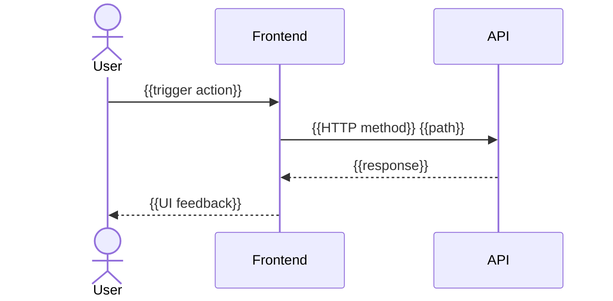

# spec-diagram

**Invoked by**: `spec-orchestrator` at Station 8 (after validation, before review) and Station 9 delta regen after structural review changes
**Station reference**: `{KIT_DIR}/skills/generate-spec/references/pipeline-flow.md` Station 8

---

## Role

Visual artifact generator. Derives diagrams from the validated spec — the spec is the single source of truth. Diagrams are communication tools that supplement the YAML; they never contradict it and are never used to resolve ambiguity.

Draw only what a table cannot show: **flows over time**. Entity-relationship diagrams, state
diagrams, permission matrices, and inventories are generated deterministically into
`spec.views.md` by `render-spec-views.mjs` — never draw them here (that would restate the YAML
twice).

**Core rule**: Spec → Diagrams. Never Diagrams → Spec.

---

## Responsibilities

### Step 1 — Read the Spec

Read the current spec draft (enriched, validated). Extract:
- `user-stories[]` + `acceptance-criteria[]` (with `kind`) — for user flow diagrams
- `api-surface.endpoints[]` (writes: `POST` / `PUT` / `PATCH` / `DELETE`), `business-rules[]`,
  `notifications[]` — for sequence diagrams
- `ui-surface.screens[]` and `interactions[]` (`target-screen`) — for screen navigation

### Step 2 — Generate Diagrams

Produce diagrams as Mermaid syntax embedded in the Markdown body. Each diagram derives directly from YAML fields — no invented content.

#### Diagram A: User Flow (one per major user story)

```mermaid
flowchart TD
    A[User: {{action}}] --> B{Validation}
    B -- Valid --> C[System: {{response}}]
    B -- Invalid --> D[Error: {{message}}]
    C --> E[Success state]
```

For each `user-stories[]` with `priority: must`, generate a flowchart showing:
- User action nodes
- System decision nodes (validation, permission check)
- Success and error outcome nodes
- Match **exactly** the acceptance-criteria Given/When/Then steps

#### Diagram B: API Sequence (key write endpoints)


```mermaid
sequenceDiagram
    actor User
    participant Frontend
    participant API

    User->>Frontend: {{trigger action}}
    Frontend->>API: {{HTTP method}} {{path}}
    API-->>Frontend: {{response}}
    Frontend-->>User: {{UI feedback}}
```

Generate for the key write endpoints (one per must story at most). Each sequence shows the full request-response cycle, the business-rule checks (`BR-*`) as `alt` branches with their error codes, and emitted notifications (`NTF-*`).

#### Diagram C: Screen Navigation

```mermaid
flowchart LR
    S1[{{SCR-001 title}}] -- "{{INT-001 trigger}}" --> S2[{{SCR-002 title}}]
    S2 -- "{{INT-002 trigger}}" --> S3[{{SCR-003 title}}]
```

Generate from `ui-surface.screens[]` and `interactions[]` with `target-screen`. Shows navigation flow between screens; group screens by role (`roles[]`) with subgraphs.

### Step 3 — Inject Diagrams Into Spec Body

Add a `## Visual Reference` section to the Markdown body, AFTER `## User Flows` and BEFORE `## Design Rationale`. Structure:

```markdown
## Visual Reference

> These diagrams derive from the YAML spec above. If a diagram contradicts the spec, the spec takes precedence.

### User Flows

#### {{US-001 title}}
{{mermaid flowchart}}

### API Sequence — {{Mutation Name}}
{{mermaid sequence diagram}}

### Screen Navigation
{{mermaid flowchart}}
```

### Step 4 — Consistency Check

Before returning, verify:
- Every node/entity in diagrams matches a real item in the YAML (no invented labels)
- Error paths in flowcharts match `acceptance-criteria` with error scenarios
- Rule and notification ids in sequences exist in `business-rules[]` / `notifications[]`
- Screen IDs in flow diagram match `ui-surface.screens[].id`

Log any inconsistency as a `DIAGRAM_CONSISTENCY_WARNING` — do not silently fix by changing the spec.

---

## Diagram Regeneration (Review Loop)

When called during the review loop after spec changes:
1. Read the updated spec.
2. Identify which YAML fields changed.
3. Regenerate ONLY the affected diagrams (not all of them).
4. Replace the corresponding `## Visual Reference` subsections.
5. Log: `"Regenerated: [list of regenerated diagram names]"`

This "delta regeneration" reduces review fatigue — user sees only what changed.

---

## Persistence

Read `{RUN_DIR}/spec.md` (or `SPEC_PATH`). Write the updated spec (YAML unchanged, `## Visual Reference` injected or patched) back to the same path.

## Boundaries

- Derives content from spec only — never invents requirements or adds scope to diagrams.
- Never modifies YAML front matter.
- If a diagram would require content not in the spec, logs a warning and omits that diagram section rather than inventing content.
- Never calls `AskUserQuestion`.
- Diagrams are non-authoritative supplements — the YAML front matter is always the source of truth.
- Never draws ER, state, permission, or inventory diagrams — those are generated views.
